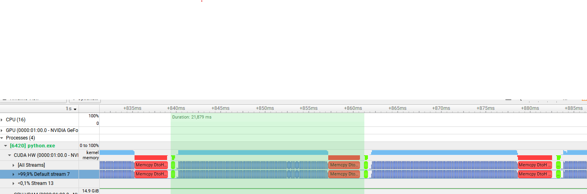
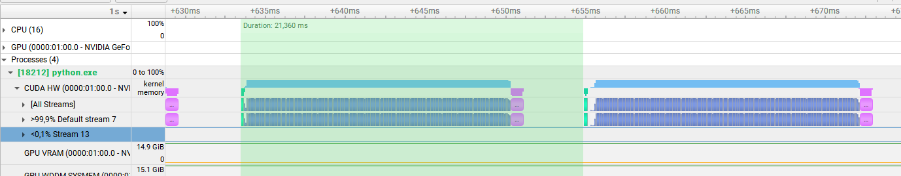
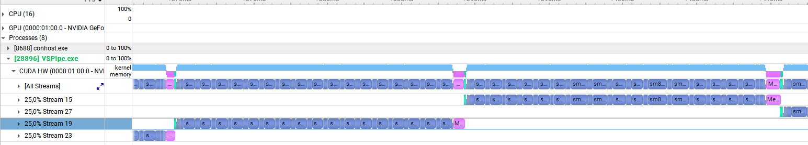
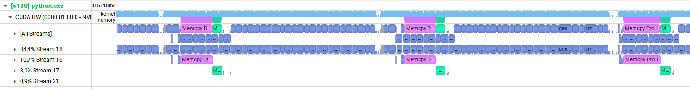
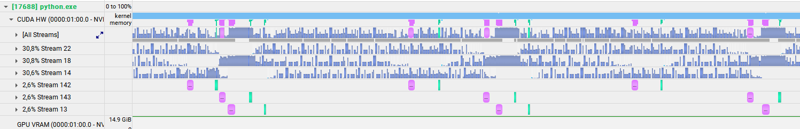

**on going**

Don't wand to read? I don't want to write, so let's do something simple

- Inference with PyTorch on a CUDA HW.
- For this study, the only difference between an inference with PyTorch and an inference with TensorRT is the inference speed.
- Would you like to know more?
[Nvidia blog: How to Optimize Data Transfers in CUDA C/C++](https://developer.nvidia.com/blog/how-overlap-data-transfers-cuda-cc/)

 

Legend:
- Blue: math operations of the inference
- Green: Host to Device transfer (HtoD): CPU -> GPU
- Red/Purple: Device to Host transfer (DtoH): GPU -> CPU

 

## Simple iteration with PyTorch and Pageable memory
Simple iteration, single stream, single python thread

- Some advantages:
    - simple software design, code is simple
- Some drawbacks:
    - DtoH and HtoD transfers are slow

 

## Simple iteration with PyTorch and Pinned memory
Simple iteration, single stream, single python thread

- Some advantages:
    - Simple software design
    - DtoH and HtoD transfers are fast
- Some drawbacks:
    - the code is less simple: memory allocation. CuPy used to manage memory (other libs such as Numba can also be used)
    - the speed not improved because a transfer from the pinned memory to the user space memory is needed

 

## CPU multithreading, multiple GPU streams (example with a C++ lib)
I didn't code this because it's not worth it.

- Some advantages:
    - there is no gap between DtoH and HtoD transfers
- Some drawbacks:
    - there is still a gap of max(DtoH, HtoD) between 2 inferences
    - multiple streams with higher memory consumption: risk of out of memory error with big models

 

## Python multithreading, multiple GPU streams
Use a single stream for the inference, and one per transfers

- Some advantages:
    - the gap between math operations is lower than min(DtoH, HtoD)
    - only a single stream for the math operation. Reduced memory usage
- Some drawbacks:
    - there is still a gap of max(DtoH, HtoD) between 2 inference
    - the software design is more complex:
        - memory management
        - python threads: management of error cases

> [!IMPORTANT]
> **This is what is implemented in Pynference**

> [!NOTE]
> What is implemented here is the normalization of pixel values to [0..1] and image conversion to and from tensor (hwc <-> nchw) by the GPU. It could be done in by the CPU in other python threads to not interrupt the inference.

> [!NOTE]
> However, if these operations are slower than the inference task, it could have a bad impact on the fps.
> To avoid this, the software has to be designed to make the inference the critical task has much as possible if it's slower.
> **Or** to use the above implementation if the encoding/decoding tasks are the critical tasks.
> An implementation with threadpoolexecutor (and multiprocessing for some cases) to perform these operations would be the way to go.

 

## Python multithreading, multiple GPU streams
Using 3 streams for inference, and others for the DtoH and HtoD operations

- Some advantages:
    - the GPU usage is the highest
- Some drawbacks:
    - the software design is lot more complex
    - a higher memory consumption: risk of out of memory error with big models
